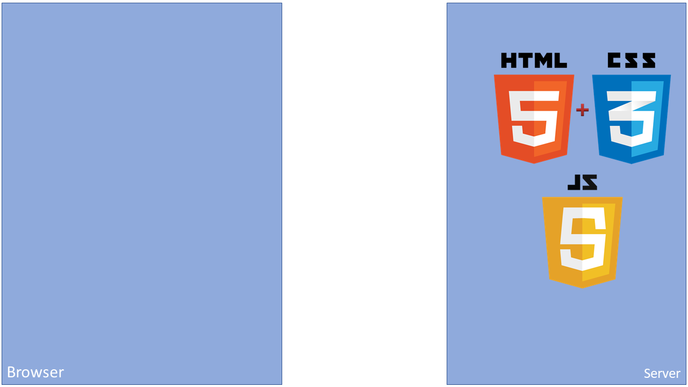

### bbv Focusday (Remote)

## Progressive Web Apps

https://github.com/froko/bbv-focusday-pwa

---

### Intro & Motivation

- Web applications as starting point
- Cross-Platform Developemnt
- Mobile-first
- Offline Support
- User Engagement
- ... just like an App!

+++

### Intro & Motivation

- One Team
- One Code Base
- Maximum Reach

---

### Characteristics

@snap[north-east]

@snapend

@ul

- Progressive
- Responsive
- Connectivity Independent
- App-like
- Fresh
- Save
- Discoverable
- Installable
- Re-engagable
- Linkable
  @ulend

Note:

- Progressive: Auch ältere Browser werden unterstützt. Der Funktionsumfang der App wächst mit der Aktualität des Browsers
- Responsive: Verfügbare Bildschirmabmessungen sollen bestmöglich genutzt werden. Das Design der App kann sich anpassen
- Connectivity Independent: Die App soll auch in Funklöchern funktionieren
- App-like: Fühlt sich an wie eine native App (Animationen, Navigation, Nutzung nativer Schnittstellen)
- Fresh: Die App soll sich und ihre Daten automatisch auf dem laufenden Stand halten
- Save: Die Anwendung und die Daten müssen über HTTPS übertragen werden
- Discoverable: Eine PWA soll sich von einer regulären Website unterscheiden
- Installable: Eine PWA soll sich via Browser auf dem Zielgerät installiren lassen
- Re-engagable: Den Nutzer via Push-Nachrichten an die App binden
- Linkable: Auf eine PWA kann via URL verwiesen werden

+++

### Architecture Overview

@snap[north-east]

@snapend



+++

### Architecture Overview

@snap[north-east]

@snapend


+++

### Architecture Overview

@snap[north-east]

@snapend


+++

### Architecture Overview

@snap[north-east]

@snapend


+++

### Architecture Overview

@snap[north-east]

@snapend


+++

### Architecture Overview

@snap[north-east]

@snapend


+++

### Architecture Overview

@snap[north-east]

@snapend


+++

### Deployment (Web app manifest)

@snap[north-east]

@snapend

```json
{
  "name": "HackerWeb",
  "short_name": "HackerWeb",
  "start_url": ".",
  "display": "standalone",
  "background_color": "#fff",
  "description": "A simply readable Hacker News app.",
  "icons": [
    {
      "src": "images/touch/homescreen48.png",
      "sizes": "48x48",
      "type": "image/png"
    },
    {
      "src": "images/touch/homescreen72.png",
      "sizes": "72x72",
      "type": "image/png"
    },
    {
      "src": "images/touch/homescreen96.png",
      "sizes": "96x96",
      "type": "image/png"
    },
    {
      "src": "images/touch/homescreen144.png",
      "sizes": "144x144",
      "type": "image/png"
    },
    {
      "src": "images/touch/homescreen168.png",
      "sizes": "168x168",
      "type": "image/png"
    },
    {
      "src": "images/touch/homescreen192.png",
      "sizes": "192x192",
      "type": "image/png"
    }
  ]
}
```

+++

### Examples

@snap[north-east]

@snapend

- Spotify ( [https://open.spotify.com/](https://open.spotify.com/) )
- Twitter ( [https://twitter.com/](https://twitter.com/) )
- [https://progressivewebapproom.com/](https://progressivewebapproom.com/)

+++

### Web App Gap

@snap[north-east]

@snapend


---

@snap[north span-85]

### Project Fugu

@snapend

@snap[north-east]

@snapend


@snap[south span-85]
@fa[quote-left quote-graphql](Let's bring the web back - API by API)
@snapend

+++

### Project Fugu

@snap[north-east]

@snapend

- Native File System API
- Shape Detection
- Contact Picker API
- Web NFC
- ...

+++

### Project Fugu

@snap[north-east]

@snapend

```javascript
if ("chooseFileSystemEntries" in window) {
  const handle = await window.chooseFileSystemEntries();
  const file = await handle.getFile();

  // do shomething with the file
} else {
  // use fallback API or disable feature in app
}
```

+++

### Project Fugu

@snap[north-east]

@snapend

Live-Demo: [https://paint.js.org](https://paint.js.org)

---

### Advantages

@snap[north-east]

@snapend

- One code base, maximum reach
- Fewer bugs due to less code
- No app store required
- No app store approvals required
- Easy deployment
- Latest app version is always available

+++

### Disadvantages

@snap[north-east]

@snapend

- Web App Gap
  - not all native APIs are available on the web platform
  - expected to get smaller thanks to Project Fugu
  - not all web APIs are available in every browser
- No control over execution environmnent
- Requires an up-to-date browser
- Responsive design can be hard & time consuming
- iOS denies PWA notifications

---

### Electron

@snap[north-east]

@snapend

- Desktop Container (Windows, MacOS, Linux)
  - Slack
  - Microsoft Teams
  - Visual Studio Code
  - ...

+++

### Advantages

@snap[north-east]

@snapend

- Many desktop target platforms
- Access to all native APIs
- Well-defined runtime environment (Chromium & Node.js)

+++

### Disadvantages

@snap[north-east]

@snapend

- Wrapper is large in size (100MB +)
- Outdated Node.js & Chromion versions (security risks)
- Regular updates required by developers
- Each Electron instance leads to RAM overhead

---

### Apache Cordova

@snap[north-east]

@snapend

- Runtime container for all devices (Mobile, Desktop)
- Alternative: Capacitor
  - Provided by Ionic
  - Backwards-compatible with Cordova

+++

### Advantages

@snap[north-east]

@snapend

- Supports app development for iOS, Android, macOS, Windows
- Access to all native APIs
- Official App Store deployments

+++

### Disadvantages

@snap[north-east]

@snapend

- Cordova's web and Electron platforms are invonvenient to use
- Dependent on guidelines and goodwill of platform providers
- App/update validation can take several hours or days

---

### Summary

- Developers should aim for Progressive Web Apps
- If required, web apps can be (additionally) wrapped in a Cordova or Electron container
- Web app investment always pays off!
- Consider Cordova and Electron as "uber-pollyfills" that might become increasingly irrelevant in the future
- Feature-detect modern Web APIs and use them, fall back to containers if unavailable

---

### Demo: Focusday Companion App


